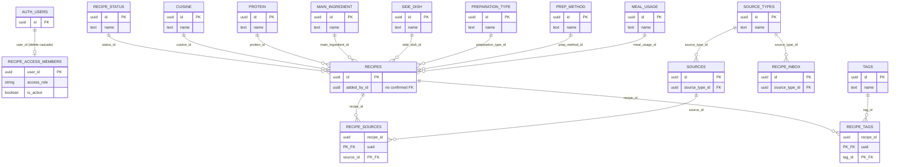

# Database architecture

## Platform and scope

The 2026-08-03 current-state snapshot describes a Supabase project on PostgreSQL 17.6. The project owns 15 tables in `public`, the `private.recipe_access_members` registry, two private authorization helpers, and `public.recipe_public_view`. All public tables were empty at snapshot time.

## Tables and relationships

Ten lookup tables are `cuisine`, `protein`, `main_ingredient`, `side_dish`, `preparation_type`, `prep_method`, `meal_usage`, `recipe_status`, `source_types`, and `tags`. Case-insensitive unique indexes on `lower(name)` protect their names (`tags` also retains its original case-sensitive unique constraint).

Primary tables are `recipes`, `sources`, and `recipe_inbox`; bridge tables are `recipe_sources` and `recipe_tags`. `recipe_inbox` is a **future AI import staging area**, not the current manual recipe-entry path. The private access registry references `auth.users` with `ON DELETE CASCADE` and permits at most one active owner.

Foreign keys use `NO ACTION` for update and delete unless noted: bridge references use `ON DELETE CASCADE`, as does the access registry's user reference. `recipes.added_by_id` has no confirmed foreign key and is intentionally shown as an unlinked attribute.

## Views, indexes, and dependencies

`public.recipe_public_view` joins recipes to eight classification lookups and uses `security_invoker=true`. The twelve FK indexes are:

- `idx_recipes_status_id`, `idx_recipes_cuisine_id`, `idx_recipes_protein_id`, `idx_recipes_main_ingredient_id`
- `idx_recipes_side_dish_id`, `idx_recipes_preparation_type_id`, `idx_recipes_prep_method_id`, `idx_recipes_meal_usage_id`
- `idx_sources_source_type_id`, `idx_recipe_inbox_source_type_id`, `idx_recipe_sources_source_id`, `idx_recipe_tags_tag_id`

The schema requires Supabase Auth (`auth.users`, `auth.uid()`), roles `anon` and `authenticated`, schemas `auth` and `extensions`, and the `uuid-ossp` extension with `extensions.uuid_generate_v4()`.

## Known schema limitations

There are no user-defined triggers, so `updated_at` is not automatically refreshed. Application timestamps use `timestamp without time zone` except access-registry timestamps. No validation checks cover negative times, servings, difficulty, inbox status, or confidence. The ingredient/step model, pantry/inventory, component/batch cooking, multi-user authorship and personal statuses, frontend, and AI import agents are not implemented.
